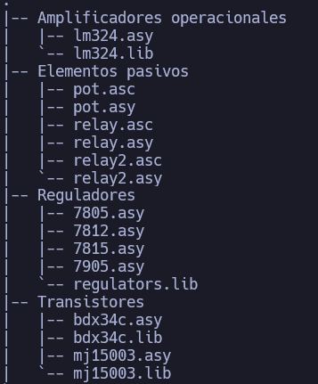

En este repositorio se encuentran los siguientes componentes:

>[!NOTE]
>
>Para poder usar estos componentes en una simulación los ficheros .lib y .asy (y todos los demás con el mismo nombre del componente) deben ser guardados en una carpeta donde LTSpice los encuentre (en Windows en la carpeta Documentos/LTsPice) o en su defecto deben estar en la misma carpeta donde se guarde el fichero de simulación. A continuación un ejemplo:
>
>
